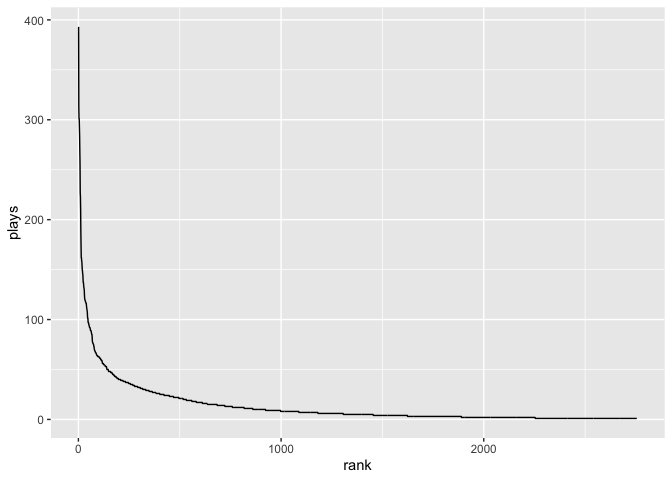

Sample RMarkdown Report
================
Your Name Here

``` r
print("hello world")
```

    ## [1] "hello world"

Running this code will reproduce part of our Hill numbers exercise from
last week:

``` r
songs_data <- read.csv("https://raw.githubusercontent.com/eco-evo-thr-2022/05-simple-metrics/hill/song_plays.csv")

head(songs_data)
```

    ##                          song rank plays
    ## 1 Dark Bird (St. Lucia Remix)    1   393
    ## 2                    Delicate    2   312
    ## 3        Almost (Sweet Music)    3   301
    ## 4                  The Archer    4   301
    ## 5                       Angel    5   293
    ## 6                       Clean    6   284

``` r
library(ggplot2)

ggplot(songs_data, aes(rank, plays)) +
  geom_line()
```

<!-- -->

The rest of last week’s script is available online at
<https://raw.githubusercontent.com/eco-evo-thr-2022/05-simple-metrics/main/hill_from_class.R>

You can copy-paste code from there to practice modifying and rendering
code in RMarkdown! Here’s an empty code block to get you started:
